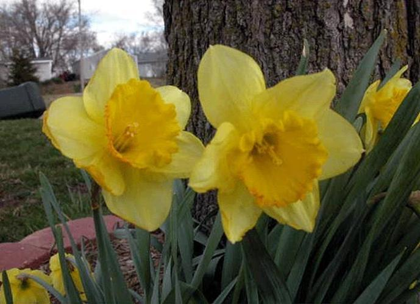
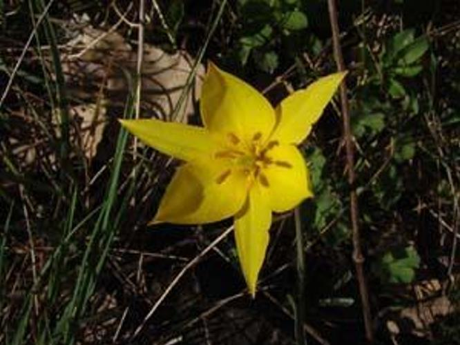

# A2 - Image Histogram Comparisons

# Overview 

**Jakob Grøhn Damgaard, May 2021** <br/>
This folder contains  assigmnent 2 for the course *Visual Analytics*

# Description
Colours constitute key markers for the visual system when faced with tasks such as object recognition and memory consolidation (Wichmann and Sharpe, 2002). Furthermore, colours can be numerically represented in e.g., a 3D RGB colour space. Thus, by being both relevant neural features and computationally manageable, colours are an obvious feature to focus on when performing a simple analysis on visual data. As an example, image similarity can be analysed by calculating the differences in the colour composition between two different images. To conduct such an analysis, the various colour nuances present in an must be quantified using a 3D colour histogram. Such a histogram represents the distribution of colour present in an image. <br>
<br>
For this assignment, we were provided with a data set consisting of images of 17 different common British flowers. The data set contains 80 images for each category.  We were then asked to compare the 3D colour histogram of a self-chosen target image with each of the other images in the corpus one-by-on using chi square distance as a similarity measure. More specifically, the task was to produce a script that, for a given input image, outputs a single .csv file containing a column for the filenames of the compared images and a column with the corresponding distance scores. Lastly, the script should print out the filename of the image found to be most similar to the input target image.


# Usage
See *General Instruction* in the home folder of the repository for instruction on how to clone the repo locally.
<br>
If not already open, open a terminal window and redirect to the home folder of the cloned repository. Remember to activate the virtual environment. Then, jump into this folder called *A2-Histogram Comparisons* using the following command:
```bash
cd A2-Histogram-Comparisons
```

Now, it should be possible to run the following command in order to get an understanding of how the script is executed and which arguments should be provided:
```bash
# Add -h to view how which arguments should be passed  
python3 src/A2-Histogram-Comparison.py -h

usage: A2-Histogram-Comparison.py [-h] [--ti target_image]

[INFO] Image similarity using color histograms

optional arguments:
  -h, --help          show this help message and exit
  -ti --target_image  [DESCRIPTION] Name of the target image 
                      [TYPE]        str 
                      [DEFAULT]     image_0001 
                      [EXAMPLE]     -ti image_0001
```
<br>
From this, it should be clear that the script can be executed using the following command:
```bash
python3 src/A2-Histogram-Comparison.py -ti image_0001
```
If there is no input to the --ti argument, image_0001.jpg is used as the default target image. Feel free to choose your own target image. As the script is already specialised to this specific assignment and this specific dataset, I’ve simplified the command line argument as much as possible to increase user-friendliness. Therefore, please note that one only has to input the image name of the desired target image and no file path or .jpg suffix is needed.

## Structure
The structure of the assignment folder can be viewed using the following command:
```bash
tree -L 2
```
This should yield the following graph:
```bash
.
├── README.md
├── data
│   └── jpg
├── output
│   └── chi_sqr_comparisons_image_0001.csv
└── src
    └── A3-Histogram-Comparison.py
```
The following table explains the directory structure in more detail:
| Column | Description|
|--------|:-----------|
```data```| A folder containing the data set used for the analysis. In this folder, the subfolder jpg holds 1382 *.jpg* files along with a *.txt* file listing all the filenames.
```src``` | A folder containing the *.py* script (*A2-Histogram-Comparison.py*) created to solve the assignment.
```output``` | A folder containing the output produced by the Python script. The script yields a *.csv* file with the file name **chi_sqr_comparisons_<image name>.csv**

# Methods
As stated, the script is coded using the principles of object-oriented programming. The main class of the script includes an ```__init__``` method which holds the set of statements used for solving the desired tasks. This collection of statements is executed when the class object is created. Furthermore, the class holds a series of utility functions which are called when needed in the ```__init__```.  The class object is created - and thus, the tasks are performed -whenever the main function is executed. This happens every time the module is executed as a command to the Python interpreter.<br>
<br>
The script takes the name of a target image as an input variable, reads in this image, and creates a 3D colour histogram with 8 bins in each dimension. It then obtains the paths for all the image file located in the data folder. Looping through all the images in the list paths one-by-one (and skipping a file if the path is identical to that of the target image), the script proceeds to generate a 3D colour histogram for each respective comparison image before calculating the chi square distance between it and the target image histogram. This value along with the given file name is then appended as a row to a Pandas (McKinney, 2010) data frame, which is exported as *.csv* file to the output folder when the loop has finished. Finally, the script prints the name and chi square value of the image with the highest similarity. Note that to make images directly comparable and to account for outliers, varying light intensity, image sizes etc., the histograms are normalized using min-max normalisation before similarity is calculated.<br>
<br>
The main library utilised for this assignment is OpenCV (Bradski, 2000).

# Results
The script runs swiftly and outputs a tidy data frame as expected. When running the script with *image_0001* set as the target image, the most similar image is found to be *image_0597* which has a chi square distance of **1242**.<br> 
```bash
python src/A2-Histogram-Comparison.py -ti image_0001
The most similar image is image_0597.jpg
This image has a chi square distance of 1242
```
<br>

### Image_0001

### Image_0597

<br>
From this example run, it is apparent that the algorithm to a certain degree captures similarity between images; the target image and the image with the lowest chi square value both depict yellow flowers photographed with a mixed green/brown background. However, color histograms only capture the proportion of the number of colours in an image and do not account for the spatial location of the colors. The target image comprises several flowers and the flower visible in image_0597 - though yellow - is clearly not of the same species. Hence, the method will often be insufficient to solve a more complex task like object recognition and serves better when used in combination with other visual analysis approaches.


# License
Shield: [![CC BY-SA 4.0][cc-by-sa-shield]][cc-by-sa]

This work is licensed under a
[Creative Commons Attribution-ShareAlike 4.0 International License][cc-by-sa].

[![CC BY-SA 4.0][cc-by-sa-image]][cc-by-sa]

[cc-by-sa]: http://creativecommons.org/licenses/by-sa/4.0/
[cc-by-sa-image]: https://licensebuttons.net/l/by-sa/4.0/88x31.png
[cc-by-sa-shield]: https://img.shields.io/badge/License-CC%20BY--SA%204.0-lightgrey.svg

