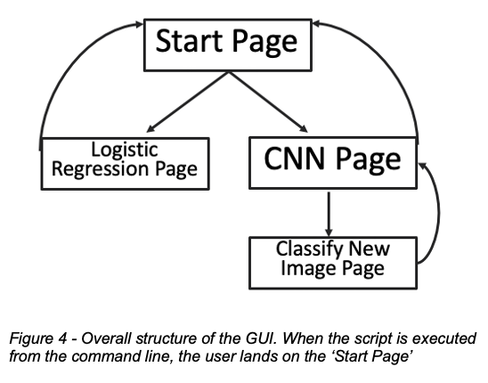
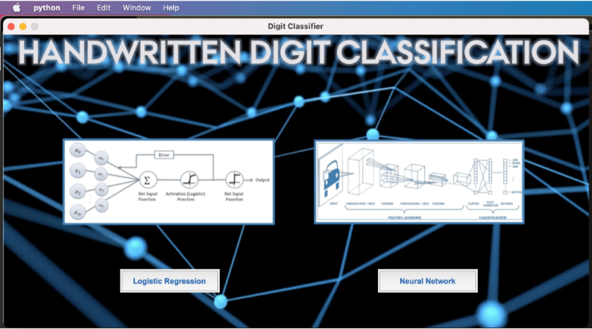
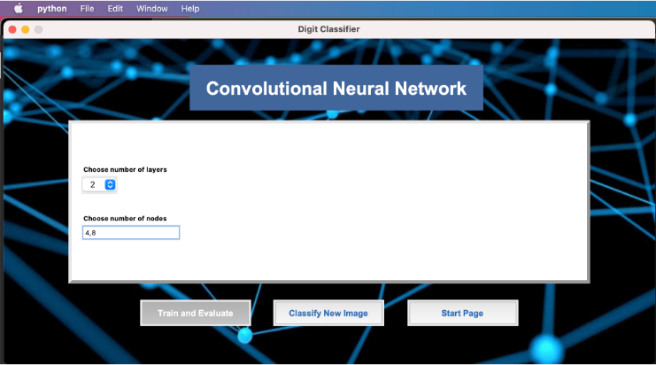
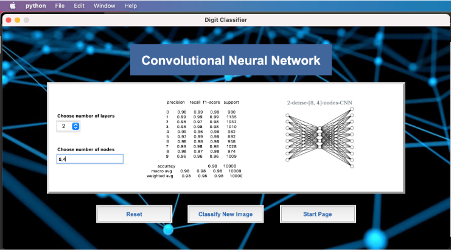
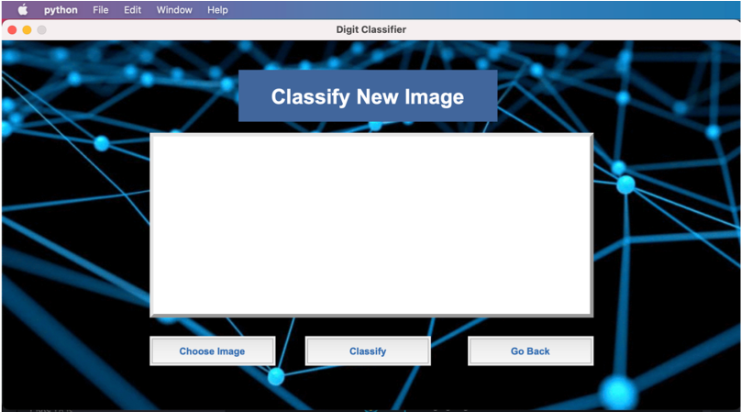
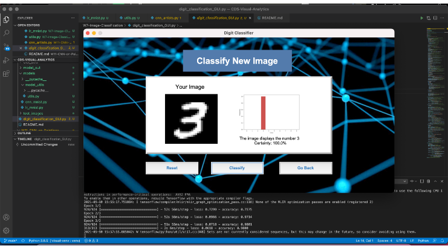
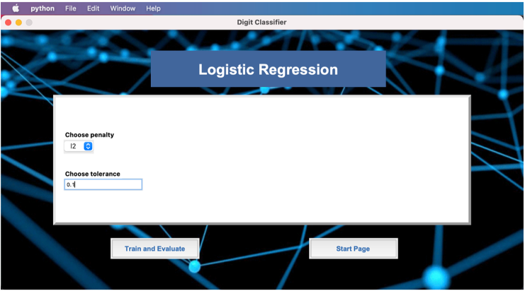
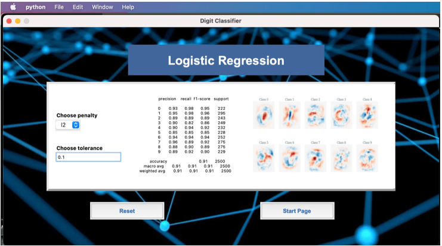
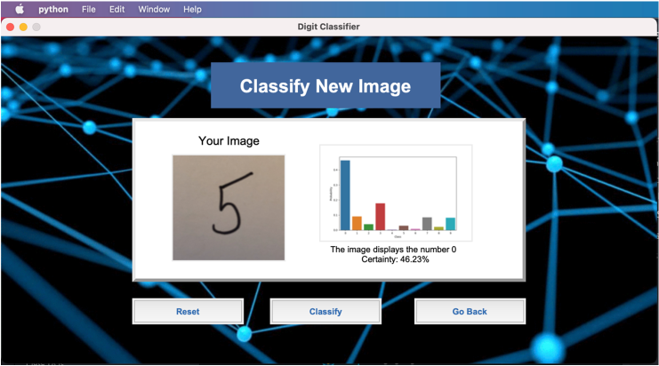

# A4 - Image Classification Benchmarks

# Overview 

**Jakob Grøhn Damgaard, May 2021** <br/>
This folder contains  assigmnent 4 for the course *Visual Analytics*

# Description
Image classification is a corner stone in the field of computer vision and visual analytics. The MNIST database is a dataset consisting of 70.000 images (28x28 pixels) of handwritten digits that is commonly used as example-data for training and testing machine learning image classification algorithms (LeCun et al., 2010). For this assignment we were tasked to create two command-line tools able to perform digit classification on the MNIST data. One script should train and test a simple logistic regression classifier and the second script should train and test a deep neural network model. <br>
<br>
As I already had experience with coding the required tasks, I decided to create an interactive tool that could give a user more intuitive, hands-on insight into the workings of both algorithm types and their outputs. This project culminated in an interactive graphical user-interface coded in Python using *tkinter* which allows the user to play around with hyperparameters and train and test various logistic regression and convolutional neural network-based digit classifiers. Furthermore, the app allows the user to upload an image from their computer and let their self-designed neural network predict which number it believes to be depicted in the image. Follow the user-guide in the following section to gain a deeper understanding of the functions embedded in the GUI.

# Initiate GUI
If not already open, open a terminal window and redirect to the home folder of the cloned repository (see *General Instruction*). Remember to activate the virtual environment. Then, jump into the folder called *A4-Image-Classification* using the following command:

```bash
cd A4-Image-Classification
```

The GUI can now be. initiated by running the following command. This will open a new window on your computer.

```bash
python3 src/digit_classification_GUI.py
```
<br>
See user-manual for instructions on how navigate the GUI and use its functions.

## Structure
The structure of the assignment folder can be viewed using the following command:

```bash
tree -L 2
```

This should yield the following graph:

```bash
.
├── README.md
├── graphics
│   ├── bgHome.gif
│   └── bgStandard.gif
├── output
│   ├── 2-dense-8,4-nodes-CNN-viz.png
│   ├── 2-dense-8,4-nodes-CNN.model
│   ├── l2-penalty-0.1-tol-nodes-LR-viz.png
│   └── latest-prediction.png
├── src
│   ├── digit_classification_GUI.py
│   └── models
├── test_images
│   ├── test_image.jpg
│   ├── test_image_2.jpg
│   ├── test_image_3.jpg
│   ├── test_image_4.jpg
│   └── test_image_5.jpg
└── user_manual
    ├── 5a.png
    ├── 5b.png
    ├── 5c.png
    ├── 5d.png
    ├── 5e.png
    ├── 5f.png
    ├── 5g.png
    ├── 7.png
    └── overview.png

```

The following table explains the directory structure in more detail:

| Column | Description|
|--------|:-----------|
```graphics```| A folder containing *.gif* files of the background graphics.
```output``` | A folder containing the output produced by the when using the GUI. This includes a folder with trained CNN models, network graphs of the fully connected part of the CNN models, bar plot showing latest prediction on self-chosen image, visualisation of importance of input nodes in logistic regresision models.
```src``` | A folder containing all the source code used for the project: <br> •	The *digit_classification_GUI.py *script contains the GUI code. <br> •	The *models* subfolder contains scripts for the logistic regression and convolutional neural network models that are utilised in by the GUI <br>    o	The *model_utils* subfolder contains a script with utility functions used in the model scripts
```test_images```| This folder contains five test images that the user can use to test the *Classify New Image* function
```user_manual```| Contains all the images used for the user-manual

## User-Manual
This section provides a brief walk-through of the structure of the GUI and introduces the interactive functionalities to the user. *Figure 4* displays the overall architecture of the app, and the arrows indicate how the user is able to navigate between the different pages. <br>
<br>

<br>
When the GUI script is executed, a new window opens and the user lands on the **Start Page**:<br>
<br>

<br>
From here, the user has the option of navigating to the **Convolutional Neural Network Page** or the **Logistic Regression Page**. E.g. when the ‘Neural Network’ button is pressed, one is redirected to the **Convolutional Neural Network Page**:<br>
<br>

<br>
On this page, the user is able to design his/her own convolutional neural network by tweaking the number of layers and nodes in fully connected part of the network. 2 convolutional layers along with a max-pooling and a dropout at layers are pre-defined in the CNN model script and cannot be adjusted. The dropdown allows the user to choose between 1, 2 or 3 fully connected layers. The user then has to fill in the desired number of nodes for the respective layers. The number of nodes for each layer should be separated by a comma. Whenever the ‘Train and Evaluate’ button is pressed, the designed model starts training on the MNIST training data. All models are set to run through 3 epochs with a batch size of 64. Note that training takes a few minutes to complete, however, progress bars should appear in the terminal enabling the user to follow the process. Also note that a model will not initiate training if there is a discrepancy between number of chosen fully connected layer and the length of the list of number of nodes that are input.<br>
<br>
When the model has finished training, its performance is tested on the test data and a table containing evaluation metrics is printed on the page. Additionally, a network graph showing the structure of the fully connected part of the network, as designed by the user, is drawn onto the page. The network graph and the trained model is saved to the *output folder*: <br>
<br>

<br>
Once a model has been trained and tested, the user has multiple options. He/she can either decide to reset the inputs and remove the plotted figures by pressing the ‘Reset’ button. He/she can also decide to return to the **Start Page** by clicking the ‘Start Page’ button. Lastly, the user can decide to proceed to a new page on which he/she can upload a self-chosen image file and let the most recently trained model make a prediction:<br>
<br>

<br>
Here, the user can choose an image from his/her computer by pressing the ‘Choose Image’ button. The *test_images* folder in the assignment folder holds 5 images which the user can use as test images for prediction. Once an image has been chosen, the user can let the model make a prediction by pressing the ‘Classify’ button. The page shows both the uploaded image along with a bar plot and a label showing the digit prediction and prediction certainty. <br>
<br>

<br>
By pressing the ‘Go Back’ button and then the ‘Start Page’ the user is redirected back to the start page. From here, the user can click the ‘Logistic Regression’ button and instead be redirected to the **Logistic Regression Page**: <br>
<br>

<br>
On this page, the user is able to adjust the penalty and tolerance hyperparameters in a logistic regression classifier. The dropdown allows the user to implement either l1, l2 or no penalty. If either l1 or l2 penalty is chosen, the user should set the tolerance level (takes a float). The tolerance indicates the stopping criterion for the model when searching for optimal parameters. When the ‘Train and Evaluate’ button is pressed, the specified logistic regression model is trained and tested. Note that this may also take a minute or two. To minimise training time, the model only trains on 7500 images and is evaluated on a test set consisting of 2500 images.<br>
<br>

<br>
After model training, a table showing the evaluation metrics is display along with a visualisation of the most important input nodes for each digit class.

# Methods
The *tkinter GUI *is coded using the principles of object-oriented programming (Lundh, 1999). The *MainApp* class initiates a container in which it stores and manages the four interactive page classes. The *MainApp* class also holds all utility functions employed in the page classes to control functions such as button presses. PIL (Clark, 2015), seaborn (Waskom, 2021) and matplotlib (Hunter, 2007) are all heavily used for plotting and image handling.<br>
<br>
The logistic regression classifier is coded using functions and the MNIST data set collected from the Scikit-learn library (Pedregosa et al., 2011). To minimise compute intensity and user-waiting time, the model is only trained on 7500 images. The sage solver is used as the solver. The script outputs an evaluation report and a visualisation of the most influential input feature for each of the 10 output nodes.<br>
<br>
The convolutional neural network in the cnn_mnist.py script is coded using the Keras interface for the TensforFlow library (Abadi et al., 2016). The network has two convolutional layers followed by a max-pooling layer and a dropout layer (dropout = 0.25). The hyperparameters for the fully connected layers are determined by the user in the GUI . 
For training the model parameters, the Adam Optimiser was used as the optimiser and categorical crossentropy was chosen as the loss function. The model trains across three epochs with a batch size of 64. This may not be enough to fully optimise the network but it minimises the waiting time for the user. The script returns an evaluation report and outputs a network graph of the fully connected layers
<br>

# Discussion of results:
The main purpose of this project was to create a user-friendly environment in which machine learning novices could gain fun and insightful, hands-on experiences with digit classification algorithms; both by interactively controlling some of the hyperparameters and by being introduced to intuitive visualisations. I believe that these criteria have been achieved successfully. <br>
<br>
The GUI also enables one to gain an insight into the workings and shortcomings of the two different algorithmic approaches. Despite its simplistic nature and shallow model structure, the logistic regression classifier is able to classify the handwritten digits with an accuracy of up to 92%. This benchmark is, however, greatly exceeded by the convolutional neural network which can be tweaked to performs with an accuracy above 98%. When training numerous models with varying it also becomes apparent that the. hyperparameters for the fully connected layers have minor influence on overall model performance and that all inputs within reasonable limits yields model performing with an accuracy around 98%. Though fully connected layers can influence a model when parameterized cleverly, for a simple network like this, most power lies in the convolutional layers (Basha et al., 2020).<br>
<br>

<br>
Lastly, the page on which the user can upload and test the model on a self-chosen image is ideal for examining how well models generalises to other images of handwritten digits. As seen in figure 5e, the model correctly predicts the digit with utmost certainty when faced with an image that is compositional identical to the images in the MNIST dataset. However, when faced with an image of a digit that is equally graspable to humans, but on e.g. a background with a different colour (as fan be seen in figure 7), the model is screwed and appears to be guessing at random. The MNIST dataset is extremely homogenous and, therefore, it is not able to generalise to images that have not been processed in the same manner.

# Critical Evaluation
Though the GUI works as intended, there are numerous aspects that could be improved during future development: 
•	An obvious improvement/expansion would be to enable the user to adjust the convolutional layers of the CNN models. As anticipated, different fully connected architectures have little influence on the performance of the CNN; the power lies mostly in the convolutional layers.
•	It would be nice to also enable classification of self-chosen images with the logistic regression models to examinate how well these models generalize.
•	Last minute bug: The a (non-fatal) warning appears in the terminal when redirecting to the **Start Page** when no models have been trained as there are no ‘panels’ to delete
•	It would be very nice include ‘help’ icons throughout the GUI with pop-up boxes appearing when hovering over with the cursor. This could e.g., provide guidelines for how to properly fill in the entry boxes for tolerance and number of nodes.
•	Restructuring code: This project was a first time-attempt at coding a multi-page GUI with tkinter and it was admittedly more complex than anticipated. Thus, much of the code could be improved or streamlined by an expert developer. Many functions could be collated into more compact functions to provide more structure.
•	One could easily change the model scripts to also make them executable on their own in the command line and make them output performance metrics in the terminal
•	It would be meaningful to also print out model training development plots to monitor over/underfitting
•	Lastly, it would enhance user experience to provide progress bars in the GUI during model training


# References
Abadi, M., Agarwal, A., Barham, P., Brevdo, E., Chen, Z., Citro, C., ... & Zheng, X. (2016). Tensorflow: Large-scale machine learning on heterogeneous distributed systems. arXiv preprint arXiv:1603.04467.
<br>
<br>
Basha, S. S., Dubey, S. R., Pulabaigari, V., & Mukherjee, S. (2020). Impact of fully connected layers on performance of convolutional neural networks for image classification. Neurocomputing, 378, 112-119.<br>
<br>
Clark, A. (2015). Pillow (PIL Fork) Documentation. readthedocs. Retrieved from https://buildmedia.readthedocs.org/media/pdf/pillow/latest/pillow.pdf<br>
<br>
Hunter, J. D. (2007). Matplotlib: A 2D graphics environment. IEEE Annals of the History of Computing, 9(03), 90-95.
<br>
<br>
LeCun, Y., Cortes, C., & Burges, C. J. (2010). MNIST handwritten digit database.<br>
<br>
Lundh, F., 1999. An introduction to tkinter. URL: www. pythonware. com/library/tkinter/introduction/index.
<br>
<br>
Pedregosa, F., Varoquaux, Ga"el, Gramfort, A., Michel, V., Thirion, B., Grisel, O., … others. (2011). Scikit-learn: Machine learning in Python. Journal of Machine Learning Research, 12(Oct), 2825–2830.
<br>
<br>
Waskom, M. L. (2021). Seaborn: statistical data visualization. Journal of Open Source Software, 6(60), 3021.


# License
Shield: [![CC BY-SA 4.0][cc-by-sa-shield]][cc-by-sa]

This work is licensed under a
[Creative Commons Attribution-ShareAlike 4.0 International License][cc-by-sa].

[![CC BY-SA 4.0][cc-by-sa-image]][cc-by-sa]

[cc-by-sa]: http://creativecommons.org/licenses/by-sa/4.0/
[cc-by-sa-image]: https://licensebuttons.net/l/by-sa/4.0/88x31.png
[cc-by-sa-shield]: https://img.shields.io/badge/License-CC%20BY--SA%204.0-lightgrey.svg


