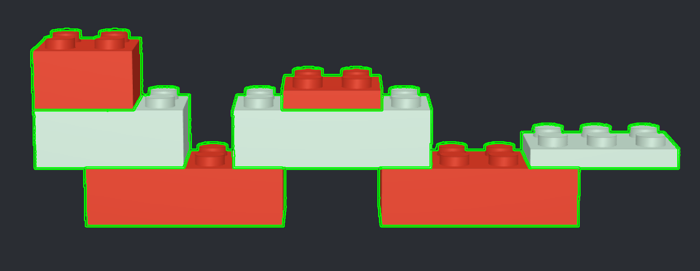
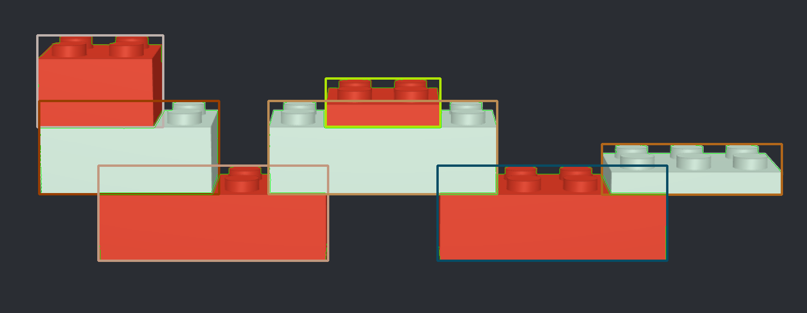
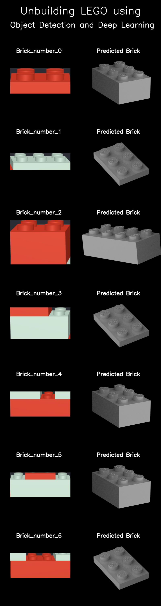
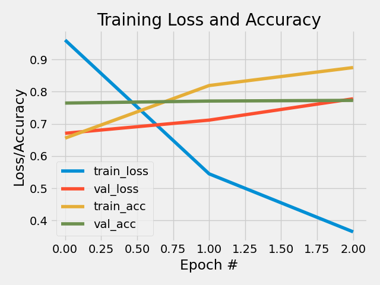

# Self-assigned - Un-building LEGO® Creations using Computer Vision

# Overview 

**Jakob Grøhn Damgaard, May 2021** <br/>
This folder contains  the self assigned assignment for the exam for the course *Visual Analytics*

*(LEGO® is a registered trademark of the LEGO Group, which does not sponsor, endorse, or authorise this. Visit the official LEGO® website at http://www.lego.com )*

# Description
For this self-assigned assignment, I decided to combine my passion for the wonderful toy LEGO® with my interest in coding to create fun and playful computer vision project. By expanding on two of the key pillars of this course, namely edge detection and image 
classification, I have attempted to create a module that is capable of detecting and classifying every single brick used in a LEGO®. Using object detection, the LEGO® model is segmented into its individual parts which are subsequently identified using a convolutional network. When people - no matter the age - see an awesome creation made out of LEGO® bricks, the first though that instantaneously springs to mind is: “Wow, how do you build that!?”. Designing and writing building instructions is a long and exhaustive manual process and few people take the time to do so. So wouldn’t it be mind-blowing if one had a piece of software that via concepts from machine learning and computer vision could, at least to a certain extent, disclose some of the techniques and bricks used in a beautiful model? <br> <br>
With this project, I attempt to crawl the humble first steps down the long path towards automating the process of deconstructing LEGO® models to figure out how they are constructed in a user-friendly and streamlined process.
<br> <br>
The task I set myself can be demarcated into two subtasks.
<br><br> 1. Modelling, training and evaluating an image classifier able to distinguish between different types of LEGO® bricks. 
For this task, I downloaded a data set of 40.000 artificially rendered images of 50 different types of LEGO bricks (800 different angles of each brick) from this link: https://www.kaggle.com/joosthazelzet/lego-brick-images?select=validation.txt
<br> <br>
2. Segmenting an image of a LEGO® model into its separate parts and subsequently predicting their brick types by using the aforementioned classifier. 

# Usage
See *General Instruction* in the home folder of the repository for instruction on how to clone the repo locally.
<br>
If not already open, open a terminal window and redirect to the home folder of the cloned repository (see General Instruction). Remember to activate the virtual environment. Then, jump into the folder called SA-Unbuild-LEGO using the following command:

```bash
cd SA-Unbuilding-LEGO
```
The main script relevant for execution is the SA-Unbuilding-LEGO.py script which is located directly in *src* folder. This scripr takes an image of a LEGO® model, partitions it into individual bricks and outputs a collage with classifications for all of the bricks. The module loads in the parameters from a pre-trained CNN that is trained in the *cnn/legoCNN.py* script on 4.200 images from the dataset. This script can also be tested if desired, however, only a minor subset of the data has been included in the GitHub repository and a folder with the optimal pre-trained model is already provided in the *outputs/model_outputs* subfolder. <vr>
<br>
To get an understanding of how *SA-Unbuilding-LEGO.py* be executed and which arguments should be provided, run the following command:

```bash
# Add -h to view how which arguments should be passed  
python3 src/SA-Unbuilding-LEGO.py -h                  
usage: SA-Unbuilding-LEGO.py [-h] [-inp --input_creation]

[INFO] Identifying Letters using Edge Detection 

optional arguments:
  -h, --help            show this help message and exit
  -inp --input_creation
                        [DESCRIPTION] Name of the file of the input image of a LEGO(R) creation 
                        [TYPE]        str 
                        [DEFAULT]     snake.png 

```
<br>
The *snake.png* file is a digitally rendered image of a simple LEGO snake that is located in the *data/creations* subfolder and has been tested on the script. It is recommended that you use this default image for your first run, but feel free to play around with the script and upload an image of your own simple LEGO creation later. <br>
The script can now be executed using the following command. 
```bash
# With input image specified
python3 src/SA-Unbuilding-LEGO.py -inp snake.png

# Without specification of input image
python3 s src/SA-Unbuilding-LEGO.py              
Input image file name is not specified.
Setting it to 'snake.png'.

```


## Structure
The structure of the assignment folder can be viewed using the following command:

```bash
tree -L 2
```

This should yield the following graph:

```bash
.
├── README.md
├── data
│   ├── creations
│   ├── example_images
│   ├── test
│   └── train
├── output
│   ├── detected_bricks
│   ├── model_outputs
│   ├── snake_bricks_with_bboxes.png
│   ├── snake_bricks_with_contours.png
│   └── snake_detected_vs_predicted_bricks.png
└── src
    ├── SA-Unbuilding-LEGO.py
    └── cnn
```

The following table explains the directory structure in more detail:
| Column | Description|
|--------|:-----------|
```data```| A folder containing the data used for the project. <br> •	The *creations* subfolder contains the image of the LEGO snake, *snake.png* (Built using Bricklink Studio 2.0) <br> •	The e*xample_image*s subfolder contains standard images of each of the 6 types of bricks that the classifier has been trained on <br> •	The *test* and *train* folders respectively hold the test (480 images) and train (4.200 images)
```src``` | A folder containing the source code for the project. <br> •	*SA-Unbuilding-LEGO.py* is the main script<br> •	The *cnn* folder contains the script for training and evaluating a cnn model on the train and test data
```output``` | A folder containing the output produced by the Python scripts: <br> •	*detected_bricks*: This subfolder holds 400x400 pixel images of the individual detected bricks found in the analysed LEGO model on a black background to match the images from the data set <br> •	model_outputs: The subfolder holds outputs from the *legoCNN.py* script.<br>      - *lego-CNN_2_epochs.model* folder contains pre-trained model <br>      -	*train_val_history_2_epochs.png* shows model training development over 2 epochs<br>      -	*name_of_classes.txt* holds a chronological list of the names of the brick types that the classifier can predict<br> •	s*nake_bricks_with_bboxes.png* shows the input image of the snake with bounding boxes drawn around the individual bricks <br> •	*snake_bricks_with_contours.png* shows the input image of the snake with contours drawn around the edges of the individual bricks<br> •	*snake_detected_vs_predicted_bricks.png* is a collage showing the classifier predictions for each of the detected bricks


# Methods
The convolutional neural network in the *legoCNN.py* script is coded using the Keras interface for the TensforFlow library (Abadi et al., 2016). The data set is pre-processed to suit the model structure by using the *tf.keras.preprocessing.image_dataset_from_directory()* function. Images are handled in a 1-channel grayscale colour space to minimise compute intensity as no images in the training set is coloured. The network has two convolutional layers followed by a max-pooling layer, a dropout layer (dropout = 0.25) and two fully connected dense layers and a final softmax layer for outputting predictions. As I quickly realised that this task is insanely complex, it was necessary take a few steps down the complexity ladder. Thus, the network is only trained on 6 different common bricks and any analysed models should only consist of these: 2x4 brick, 2x3 brick, 2x2 brick, 2x4 plate, 2x3 plate, 2x2 plate. <br>
For training the model parameters, the Adam Optimiser was used as the optimiser and Sparse Categorical Crossentropy was chosen as the loss function. The model trains across two epochs with a batch size of 16. The script outputs the model structure and evaluation results in the terminal when executed. Furthermore, it saves a figure that tracks the development during training.<br>
<br>
The S*A-Unbuilding-LEGO.py *is built up around the same core object-oriented structure and principles as the *A3-Edge-Detection.py *script. The object segmentation process (OpenCV (Bradski, 2000)) utilizes the changes in hue to detect edges. Firstly, the input image is transformed into HSV colour space. Then, it is split into the three respective channels and only hue channel is kept. Lastly, canny edge detection is performed along with a single dilation step before the contours around the bricks can be drawn. The biggest contour is removed from the list (always a contour that stretches around the entire model) and bounding rectangles are drawn around the individual bricks. These areas are then cropped out and stitched onto a black 400x400 pixel canvas to replicate the style of the images which the classifier has been trained on. One-by-one these images are pre-processed and fed to the classifier for prediction. The script outputs a final collage showing all the detected bricks side-by-side with the predictions made by the script.


# Discussion of Results
Figure 7 shows the resulting brick segmentation when running the LEGO snake through the tool. This aspect works remarkably well and all of the bricks end up being outline by a tight bounding box. The edge detection steps enabled the fine-grained drawing of two discrete thin lines on both sides of the dark edges that separate the individual bricks and this entails that each brick is fully surrounded by a distinct contour. <br>
### Imageg of segmented bricks

<br>
<br>

<br>
<br>

Let’s redirect our attention towards the performance of the classifier. Figure 9 shows the models performance metrics developments across multiple epochs. After two epochs, the validation accuracy has already stagnated while the train accuracy proceeds to increase, and the train loss drastically drops. This indicates that the model is starting to overfit, and it 
is best to halt the parameter search here. This may appear alarming at first but is important to keep in mind that the training data for each brick category solely consists of renderings of the same brick taken at different angles and therefore it is foreseeable the overfitting could quickly arise.  <br>
<br>
From *figure 9* it can also be observed that the validation accuracy starts off higher than the training accuracy. This may seem peculiar at first, but it most likely due to the dropout noise that is applied during model training but during inference.
<br>
<br>

<br>
<br>
The trained CNN model yields an overall accuracy of 77% on the test data which seems to be decent under the circumstances. Figure 10 shows how well the model has performed at correctly classifying the bricks identified in the LEGO snake. Here, it is apparent that only two (brick no. 1 and no. 3) out of seven bricks are predicted spot-on by the model. This clearly suggests that the tool is still highly faulty even when tested on the most simplistic LEGO models. Two out of seven is, nonetheless, still better than chance and it is also worth noting that all bricks are correctly identified as bricks. Akin to the problems faced when training a simple digit classifier on the MNIST, this LEGO classifier is trained on an extremely homogenous dataset, and it is therefore expected that it generalises very poorly when faced with unfamiliar data. A robust model would as a minimum need a much more comprehensive data set of labelled images of LEGO bricks in many different settings.
<br> <br>

<br>
<br>
All in all, it has been a tremendously fun project and measured solely on the basis of my initial ambitions, the results are certainly satisfactory. The tool is very highly reliable on sharp changes in colour and hue and, hence, it would face great challenges if met with even a simple model with bricks of the same colour clustered together. Were the vision of an omniscient, magical scan-a-model-and-receive-a-perfect-manual that I eagerly conveyed in the description section to ever be realized, it would demand much more complex modelling, more advanced data, and better equipment.


# References
Abadi, M., Agarwal, A., Barham, P., Brevdo, E., Chen, Z., Citro, C., ... & Zheng, X. (2016). Tensorflow: Large-scale machine learning on heterogeneous distributed systems. arXiv preprint arXiv:1603.04467.
<br>
<br>
Bradski, G. (2000). The OpenCV Library. Dr. Dobb’s Journal of Software Tools.

# License
Shield: [![CC BY-SA 4.0][cc-by-sa-shield]][cc-by-sa]

This work is licensed under a
[Creative Commons Attribution-ShareAlike 4.0 International License][cc-by-sa].

[![CC BY-SA 4.0][cc-by-sa-image]][cc-by-sa]

[cc-by-sa]: http://creativecommons.org/licenses/by-sa/4.0/
[cc-by-sa-image]: https://licensebuttons.net/l/by-sa/4.0/88x31.png
[cc-by-sa-shield]: https://img.shields.io/badge/License-CC%20BY--SA%204.0-lightgrey.svg


